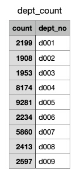
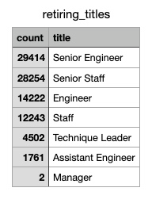

# Pewlett-Hackard-Analysis

## Overview of Analysis
The included analysis was completed at the request of Pewlett-Hackard based on an intention to proactively prepare for a large number of babyboomer employees nearing retirement. The analysis would allow the company to better understand the number of employees, departments, and positions that would be potentially retiring in order to begin planning for those vacancies. 

## Results
As suspected, there are a significant number of employees nearing retirement. 
- Some departments will be impacted by approximatley 8,000 or 9,000 retirements:
Development (d005) should anticipate 9,281 retirements. Production (d004) is not far behind with an anticipated 8,174 retirements. 

- Most employees nearing retirement will likely hold positions of a higher level, which is true in this case as well. A majority of titles nearing retirement are categorized as "Senior": Senior Engineer (29,414) and Senior Staff (28,254). 

- The included [unique_titles.csv](Data/unique_titles.csv) lists retirement-eligible employees with their most recent title since many employees may have held multiple titles during their tenure at Pewlett-Hackard.
- To assist with succession planning, employees were also identified who may be considered for mentorship opportunities. The included [mentorship_eligibility.csv](Data/mentorship_eligiblity.csv) includes employees born in 1965 and includes their start date and title within Pewlett-Hackard. 

## Summary
- Based on the included analysis, 36,619 roles will need to be filled with anticipated retirements. 
- With the given criteria for mentorship eligibility, only 1,941 employees are included. So while there are more than enough retirement-ready employees (36,619) to mentor current employees, additional employees beyond those born in 1965 should be considered in anticipation of those vacancies.  
